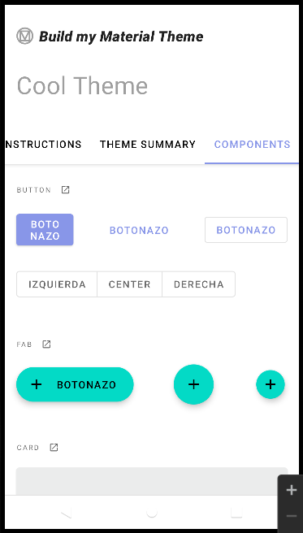

## Creación de ramas
 * Creada rama colors para modificar los colores
 * Al final hago merge de la rama colors en la rama principal
 
## Modificaciones rama Master
 * Cambiado el tamaño y texto de los botones en [component_buttons](https://github.com/Daniel-Mora-Moreno/MaterialThemeBuilder/tree/master/app/src/main/res/layout/component_buttons.xml)
 * Cambiados algunos Strings en [strings](https://github.com/Daniel-Mora-Moreno/MaterialThemeBuilder/tree/master/app/src/main/res/values/strings.xml)

## Modificaciones rama colors

* Cambiado el valor de algunos colores en [colors](https://github.com/Daniel-Mora-Moreno/MaterialThemeBuilder/tree/master/app/src/main/res/values/color.xml)
